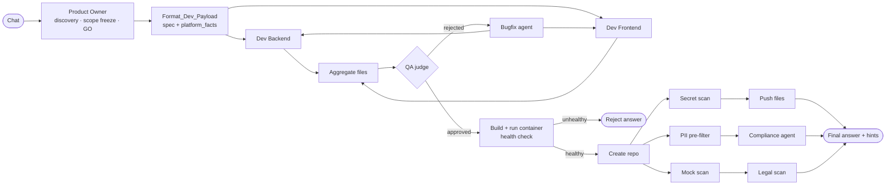

# CoreForge CI/CD Engine

> **Kurzfassung (Deutsch):** CoreForge ist eine selbst gehostete Multi-Agent-Pipeline in n8n. Aus einer Chat-Anfrage
> entsteht eine lauffähige Web-App (FastAPI + Tailwind), die automatisch in einem eigenen Docker-Container deployt,
> per Health-Check geprüft und in ein eigenes GitHub-Repository gepusht wird. Ein Product-Owner-Agent klärt den Umfang,
> zwei Entwickler-Agenten schreiben Backend und Frontend, ein QA-Agent urteilt, ein Bugfix-Agent korrigiert gezielt.
> Deterministische Prüfungen (Secret-Scan, Datenschutz-Vorfilter, Drittanbieter-Scan, Frontend-Mock-Scan) sichern das
> Ergebnis ab. Jede Änderung an der Pipeline lief durch denselben Prozess: Bestandsaufnahme, Freigabe, Offline-Test,
> isolierter Test mit Kontrollstation, Trockenlauf, Live-Verifikation und Regression mit vorab festgelegten Kriterien.

## What it does

You describe a small web app in a chat. The engine

1. clarifies the scope with you (Product Owner agent: discovery → scope freeze → "GO"),
2. writes a FastAPI backend and a single-file Tailwind frontend in parallel (two developer agents),
3. has the result judged by a QA agent; rejected code goes to a bugfix agent that patches only the affected side,
4. builds and starts a Docker container on a self-hosted host and **checks that the app actually answers**,
5. scans the deployed files (secrets, personal-data indicators, third-party resources, frontend mocks),
6. pushes the code to a new private GitHub repository (only if the secret scan is clean),
7. answers in the chat with the live link and any warnings.

Typical run after "GO": about 65–75 seconds for a small app (see *Measured results*).

## Architecture



More detail: [docs/architecture.md](docs/architecture.md).

## Agents

| Agent | Role |
|---|---|
| Product Owner | Discovery with at most 2–3 questions, scope freeze, JSON project plan after an explicit "GO". Knows the platform constraints and says openly when a wish is outside them (e.g. Node.js, CORS). |
| Dev Backend / Dev Frontend | Write `main.py` + `requirements.txt` and one `index.html`, following the spec and the shared `platform_facts`. |
| QA judge | Only judges (APPROVED / REJECTED with a patch proposal). It writes README and `.env.example`, never the code that gets deployed. |
| Bugfix agent | Turns QA issues into targeted patch instructions for one side only; max. 2 rounds. |
| Compliance agent | Runs only when the deterministic PII pre-filter finds indicators; assesses them against a fixed five-criteria table. Informative, never blocking. |

All LLM nodes use Gemini (Flash) through n8n's LangChain nodes.

## Quality & security gates

| Gate | Type | Effect |
|---|---|---|
| Deploy health check | deterministic, **fail-closed** | Container must run with `RestartCount` 0 and answer `/` with HTTP < 400, otherwise exit 97 → reject answer, no repo push |
| Secret scan | deterministic, **fail-closed** | 12 patterns (cloud/provider keys, private keys, JWT, DB URLs with credentials, generic assignments) with placeholder detection; an unreadable file blocks the push |
| PII pre-filter + Compliance agent | deterministic + LLM, fail-loud | direct / quasi / special-category indicators, calibrated against a real corpus |
| Legal scan | deterministic, fail-loud | third-party resources loaded by the app (CDNs, fonts …), with a hint on IP transfer |
| Frontend mock scan | deterministic, fail-loud | detects `fetch` overrides and data fabricated in error paths, plus spec routes the page never calls |
| `platform_facts` | shared rule set | one list of platform rules for PO, developers and QA; a drift check keeps the copies identical |

Details, including what each gate does **not** catch: [docs/quality-gates.md](docs/quality-gates.md).

## Measured results

All numbers come from raw n8n execution records and the deployed apps, not from the chat answers.

| What | Before | After |
|---|---|---|
| QA silently changing generated code | 19 of 23 runs | 2 of 10 after better developer prompts, **0** since the QA only judges (deployed code = developer version, byte-identical in 10/10 runs, twice) |
| Frontend mocks in the developer output | 23 of 24 runs | **0 of 31** runs since the prompt change |
| QA completion tokens per run (median) | 4,684 | **403 (−91 %)**; QA step 27.8 s → 8.9 s |
| Run time after "GO" (median) | 122.5 s | 96.5 s → 74.5 s → **66.5 s** |
| Regression sets (5 fixed app requests × 2) | – | 3 × **10/10** healthy deployments after each larger change, plus one live control run for the mock scan (13/13 checks in the raw record) |

Note on run time: the 122.5 s baseline is the median of 16 earlier runs with different apps; the later values are medians
of the fixed regression set. They show the trend, not an exact A/B comparison.

## How it was built

This engine was designed, decided and operated by **Marc Powell**; **Claude / Claude Code (Anthropic)** acted as
pair programmer. Every change to the live pipeline went through the same steps:

1. **Step 0 – read only:** inventory with real data (execution records, deployed code), findings with counts.
2. **Decision** by Marc, including the success criteria for the regression, fixed *before* any run.
3. **Offline test** of the exact code that will be deployed (module + patch, positive and negative controls).
4. **Isolated test** in a throw-away n8n workflow with the real runtime, a **control station** running the old code next to
   the new one, and forced edge cases (e.g. both arrival orders at a merge gate, unreadable binaries).
5. **Dry run** of the live patch: preconditions (live state == backup, old code exactly as expected), nothing written.
6. **"go"** → backup, `PUT`, verification by a fresh `GET` (only the intended fields changed, byte-identical to the tested code).
7. **Regression** against the pre-defined criteria; results are checked in the raw records and in the running apps.

Lessons that shaped the rules are in [docs/engineering-log.md](docs/engineering-log.md) (e.g. "nothing found" is not proof
that anything was read; a green chat answer is not proof that the app runs).

## Tech stack

n8n 2.x (self-hosted) · Google Gemini (Flash) · FastAPI · Tailwind CSS · Docker · Proxmox VE · GitHub API · Node.js (tests, tooling)

## Repository layout

```
workflow/   the n8n workflow, sanitized (credentials, hosts and IDs replaced by placeholders)
src/        modules that are embedded 1:1 in Code nodes (file extractor, mock scan, platform_facts)
tests/      offline tests that run the Code nodes of the published workflow: no network, no n8n
scripts/    sanitizer for the workflow export, pre-push checks
examples/   the patch / live-patch / isolated-test pattern as used in the project (need an n8n instance)
docs/       architecture, quality gates, engineering log
```

```bash
node tests/run_all.js     # or: npm test   (Node 18+, no dependencies)
```

To import the workflow into your own n8n: create credentials for Gemini, SSH (docker host) and GitHub, replace
`<DOCKER_HOST>`, `<N8N_HOST>` and `<GITHUB_OWNER>` in the `Config` node, and select your credentials in the nodes marked
`REPLACE_WITH_YOUR_CREDENTIAL_ID`. Code comments and some prompts are in German (the project language).

**Security note:** the chat trigger is set to `public: true`. Anyone who can reach its URL can start builds that deploy
containers and create GitHub repositories. Run it only inside a protected network, or add authentication in front of it
before exposing it to the internet.

## Limitations / known gaps

- The health check only tests `/`: broken API routes or JavaScript errors in the browser are not caught.
- The mock scan does not detect a faked success status without random data or mock names, or business logic duplicated in
  the browser; those cases were found by hand review.
- The PII pre-filter matches words, not structure (e.g. `patient_health_records` in snake_case is missed).
- The eighth platform fact ("platform_facts override any conflicting specification item") has not yet had to resolve a
  real conflict live.
- The repair retry for unreadable QA output is proven in isolation only; it never triggered in a live run.
- A failed health check is reported, not yet fed back into the bugfix loop.
- Generated apps are meant for a private LAN: no authentication, no HTTPS.
- LLM outputs are non-deterministic; the 10-run regression sets show trends, not guarantees.

## Author

Marc Powell · [mpcore.cloud](https://mpcore.cloud)

## License

MIT, see [LICENSE](LICENSE).
