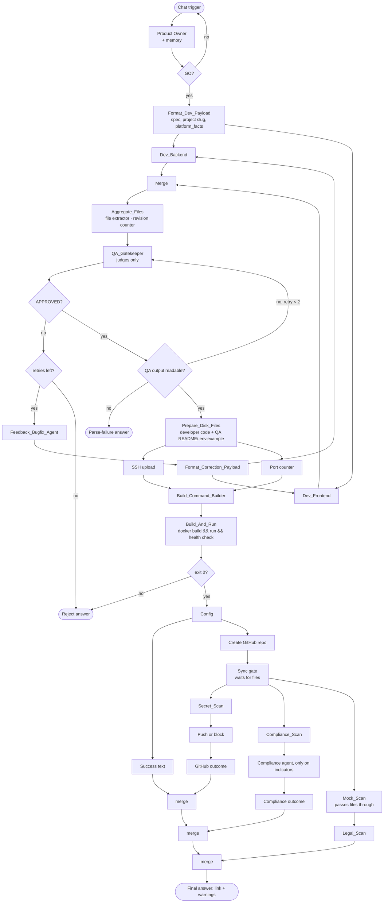

# Architecture

The whole engine is one n8n workflow (57 nodes, `workflow/coreforge-cicd-engine.sanitized.json`). n8n runs parallel
branches one after another (`executionOrder: v1`, order by canvas position), so every place where branches meet again is
an explicit merge gate. The chat trigger answers with the output of the last node that ran, which is why every additional
branch is chained into the feed of an existing consumer instead of being left open.

## Key design decisions

- **The QA judges, it does not rewrite.** Deployed code is always the last developer version. The QA returns APPROVED or
  REJECTED with a concrete patch; only README and `.env.example` come from the QA. This made the QA's effect measurable and
  cut its output by 91 %.
- **One source for platform rules.** `platform_facts` (same origin, `FileResponse` for `/`, no mocks, safe DOM updates,
  no polling unless asked, fixed port …) is built once and passed to developers and QA; the Product Owner prompt contains
  a verbatim copy. A drift check (`src/platform_facts.js`) keeps both places identical.
- **Deterministic before LLM.** The compliance LLM only runs when a deterministic pre-filter finds indicators; secrets,
  third-party loads and mocks are checked by code, not by a model.
- **Fail-closed where it protects, fail-loud where it informs.** Health check and secret scan block; compliance, legal and
  mock scan never block but make read errors visible.
- **Binary files are read the official way.** n8n keeps binaries on disk; the item only carries a marker, so every scan
  reads through `helpers.getBinaryDataBuffer` (reading the marker instead once made all scans silently "clean").
- **Central configuration.** Host addresses and the GitHub owner live in one `Config` node; secrets live in n8n credentials.

## Runtime

| Component | Where |
|---|---|
| n8n | LXC container on Proxmox VE |
| Generated apps | one Docker container per app on a separate VM, dynamic port, restart policy `unless-stopped` |
| Code | one private GitHub repository per app |
| Models | Gemini Flash via n8n LangChain nodes |
